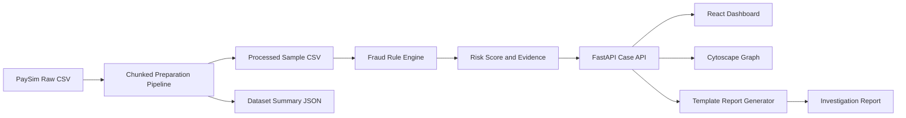
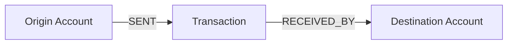
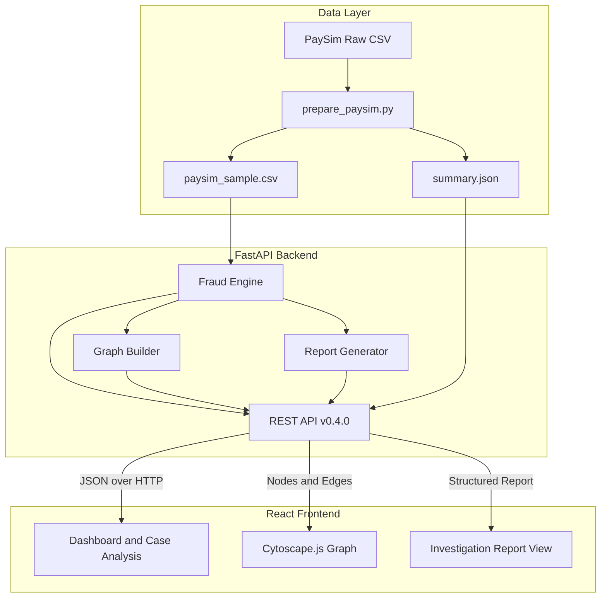

<div align="center">
<p align="center">
  
</p>


# Nexus Fraud Intelligence

> AI-powered Financial Fraud Investigation Platform using Graph Intelligence and Explainable Risk Scoring.

<p align="center">

🌐 **Live Demo**  
https://nexus-fraud-intelligencezip--hazem118.replit.app

</p>

### Explainable financial fraud investigation through transparent risk scoring, interactive graph analysis, and structured analyst reports.

*From a suspicious transaction to connected context, evidence, risk, and an investigation-ready report — in one workflow.*

[](https://nexus-fraud-intelligencezip--hazem118.replit.app)
[](#implementation-status)
[](#technology-stack)
[](#technology-stack)
[](#graph-investigation-model)
[](#dataset-and-prototype-validation)

[📄 Hackathon Presentation](./Nexus%20Fraud%20Intelligence.pdf) · [🏗️ Architecture](#system-architecture)

</div>

> [!IMPORTANT]
> **Prototype scope.** Nexus is a hackathon MVP built with synthetic PaySim transactions. It is not connected to a real bank, does not process real customer data, and must not be used to make automated operational decisions. The current investigation report is generated from a deterministic template; grounded LLM-assisted reporting is part of the roadmap.

---

## Table of Contents

- [Overview](#overview)
- [The Problem](#the-problem)
- [The Nexus Approach](#the-nexus-approach)
- [End-to-End Workflow](#end-to-end-workflow)
- [Key Capabilities](#key-capabilities)
- [Implementation Status](#implementation-status)
- [Prototype Results](#prototype-results)
- [Explainable Risk Engine](#explainable-risk-engine)
- [Graph Investigation Model](#graph-investigation-model)
- [Dataset and Prototype Validation](#dataset-and-prototype-validation)
- [System Architecture](#system-architecture)
- [Technology Stack](#technology-stack)
- [User Experience](#user-experience)
- [API Reference](#api-reference)
- [Project Structure](#project-structure)
- [Demo Script](#demo-script)
- [Design Principles](#design-principles)
- [Known Limitations](#known-limitations)
- [Roadmap](#roadmap)
- [Frequently Asked Questions](#frequently-asked-questions)
- [Team](#team)

---

## Overview

**Nexus Fraud Intelligence** is an explainable financial-fraud investigation prototype created by **Team Nexus** for a four-day fintech hackathon.

Traditional monitoring systems often present fraud analysts with isolated alerts: one transfer, one account, or one rule violation at a time. Nexus adds investigative context around the alert. It evaluates the transaction using transparent rules, exposes the evidence behind the score, connects related accounts and transactions inside an interactive graph, and generates a structured report for analyst review.

The current MVP demonstrates a complete working flow:

```text
PaySim Transactions
        ↓
Chunked Data Preparation
        ↓
Explainable Fraud Rules
        ↓
Nexus Risk Score (0–100)
        ↓
Related Account–Transaction Graph
        ↓
Interactive Analyst Dashboard
        ↓
Structured Investigation Report
```

Nexus is intentionally designed as a **decision-support tool**, not an autonomous fraud adjudication system. A human fraud analyst remains responsible for reviewing the evidence and deciding what action, if any, should be taken.

<details>
<summary><b>🇸🇦 ملخص المشروع بالعربية</b></summary>

**Nexus Fraud Intelligence** هو نموذج أولي لمنصة تساعد محلل الاحتيال المالي على الانتقال من معاملة مشبوهة إلى صورة تحقيق أوضح. يقوم النظام بتحليل المعاملة بقواعد شفافة، وحساب درجة مخاطر من 100، وعرض الحسابات والمعاملات المرتبطة داخل رسم بياني تفاعلي، ثم إنشاء تقرير منظم يوضح المؤشرات والإجراءات المقترحة.

النسخة الحالية تستخدم بيانات **PaySim** الاصطناعية ولا تتصل بأي بنك حقيقي. كما أن درجة المخاطر ليست احتمالًا إحصائيًا لوقوع الاحتيال، بل درجة تفسيرية ناتجة عن مجموع مؤشرات واضحة. التقرير الحالي مبني على قالب ثابت، بينما التكامل مع نموذج لغوي مولد ضمن خارطة الطريق.

</details>

---

## The Problem

Fraud rarely happens as a clean, isolated event. Organized schemes may involve multiple accounts, repeated transfers, balance-draining behavior, shared beneficiaries, rapid movement of funds, and transaction chains that are difficult to understand from a flat alert list.

Fraud investigators therefore face three practical problems:

| Challenge | Why it matters |
|---|---|
| **Alerts lack connected context** | A transaction may appear suspicious, but the analyst still needs to understand the surrounding accounts and activity. |
| **Opaque scores slow investigations** | A risk number without evidence is difficult to trust, explain, or defend. |
| **Reporting is repetitive** | Analysts spend time converting technical signals into readable investigation summaries and recommended next steps. |

The core problem can be summarized as:

> **Fraudsters operate through connected activity, while many alerts are still investigated one transaction at a time.**

---

## The Nexus Approach

Nexus combines four layers into one analyst workflow:

1. **Transparent transaction analysis** — deterministic rules evaluate transaction type, amount, balances, and repeated activity.
2. **Explainable risk scoring** — every score contribution is returned as a named indicator with a description and point value.
3. **Graph-based investigation context** — related accounts and transactions are visualized as a navigable network.
4. **Structured investigation reporting** — verified findings are transformed into a consistent analyst-facing report.

### What makes the approach useful

Nexus does not stop at saying that a transaction is risky. It answers the questions an investigator needs next:

- **Why** did the transaction receive this score?
- **Which** accounts and transactions are connected to it?
- **What** suspicious indicators were detected?
- **How** should the case be prioritized?
- **What** actions should an analyst consider?

---

## End-to-End Workflow



### Analyst journey

1. Open the dashboard.
2. Review sample alerts across Critical, High, Medium, and Low risk.
3. Select a case.
4. Inspect the transaction, balances, score, and detected indicators.
5. Explore the related account–transaction graph.
6. Generate an investigation report.
7. Review recommended actions and preserve the evidence for human decision-making.

---

## Key Capabilities

- **Real PaySim integration** — the prototype processes a public synthetic mobile-money fraud dataset rather than relying only on hard-coded mock objects.
- **Memory-conscious preparation** — the raw CSV is read in chunks of 200,000 rows.
- **Explainable scoring** — every point added to the score is linked to a specific rule and human-readable reason.
- **Four risk levels** — Low, Medium, High, and Critical.
- **Interactive graph visualization** — accounts and transaction nodes are rendered with Cytoscape.js.
- **Case-based investigation** — every analyzed transaction is exposed as a case with details, evidence, and graph context.
- **Balanced alert demonstration** — the dashboard intentionally presents cases from all four risk categories.
- **Structured reports** — the backend generates summaries, network statistics, indicators, recommended actions, validation notes, and a disclaimer.
- **Documented REST API** — FastAPI automatically exposes OpenAPI/Swagger documentation.
- **Human-in-the-loop design** — the application supports analysts; it does not automatically freeze accounts or declare fraud.

---

## Implementation Status

The table below separates what is working today from what is planned. This distinction is intentional: the repository documents the real MVP without overstating future capabilities.

| Capability | Status | Notes |
|---|:---:|---|
| PaySim raw-data preparation | ✅ Implemented | Chunked processing of the full CSV. |
| Processed graph-ready sample | ✅ Implemented | 4,193 transactions in the current sample. |
| Explainable transaction rules | ✅ Implemented | Seven evidence-producing checks. |
| Risk score and risk level | ✅ Implemented | Score capped at 100. |
| Dashboard metrics | ✅ Implemented | Sample size, high-risk alerts, critical alerts, prototype recall. |
| Alert selection | ✅ Implemented | Balanced sample across all risk levels. |
| Case detail API | ✅ Implemented | Transaction, balances, analysis, validation. |
| Account–transaction graph | ✅ Implemented | Cytoscape-ready nodes and directed edges. |
| Interactive graph UI | ✅ Implemented | Account and transaction node inspection. |
| Structured investigation report | ✅ Implemented | Deterministic template; no external LLM required. |
| Swagger/OpenAPI documentation | ✅ Implemented | Available at `/docs` while the backend is running. |
| Device and IP nodes | 🗺️ Roadmap | Part of the original multi-entity product vision. |
| Explicit transaction-chain rules | 🗺️ Roadmap | Temporal and graph-level pattern detection. |
| Grounded LLM report generation | 🗺️ Roadmap | LLM receives only structured, verified evidence. |
| Persistent case management | 🗺️ Roadmap | Status, analyst ownership, notes, audit history. |
| Real-time transaction ingestion | 🗺️ Roadmap | Current MVP analyzes a prepared dataset. |
| Real bank integration | 🗺️ Roadmap | Requires secure sandbox access and regulatory controls. |

---

## Prototype Results

The current processed sample contains **4,193 transactions**. Running the Nexus rule engine produces the following risk distribution:

| Risk level | Score range | Transactions |
|---|---:|---:|
| Low | 0–29 | 1,007 |
| Medium | 30–59 | 2,127 |
| High | 60–79 | 512 |
| Critical | 80–100 | 547 |
| **Total** | — | **4,193** |

### Validation snapshot

| Metric | Current prototype result |
|---|---:|
| PaySim-labeled fraud rows in the sample | 30 |
| Labeled fraud rows classified High or Critical | 23 |
| Prototype recall on the selected sample | **76.67%** |
| Total High + Critical cases | 1,059 |

The prototype recall is calculated as:

```text
23 PaySim-labeled fraud rows classified High/Critical
------------------------------------------------------  = 76.67%
30 PaySim-labeled fraud rows in the selected sample
```

> [!CAUTION]
> **76.67% is not overall model accuracy.** It is recall on a deliberately curated hackathon sample. The sample contains selected fraud seeds, transactions connected to those entities, and a limited set of normal `TRANSFER` and `CASH_OUT` transactions. It is useful for validating the workflow, but it is not an unbiased production benchmark.

Nexus also treats the score correctly as an **evidence score**, not a calibrated probability. A score of `90/100` does **not** mean there is a 90% statistical probability of fraud.

---

## Explainable Risk Engine

The current engine evaluates each transaction using transparent rules. The PaySim fields `isFraud` and `isFlaggedFraud` are **not** used to calculate the Nexus score.

| Rule | Condition | Score contribution |
|---|---|---:|
| High-risk transaction channel | Type is `TRANSFER` or `CASH_OUT` | +10 |
| Large transaction | Amount is at least 200,000 | +20 |
| Origin balance drained | Transaction moves almost the complete available balance and leaves the origin near zero | +35 |
| Origin balance mostly drained | At least 80% of the origin balance is removed and the account is left near zero | +25 |
| Origin balance mismatch | Recorded post-transaction origin balance differs materially from the expected balance | +15 |
| Destination balance mismatch | Recorded destination balance differs materially from the expected received balance | +15 |
| Repeated origin activity | Origin performs at least two transactions in the same PaySim time step | +10 |
| Repeated destination activity | Destination receives at least two transactions in the same PaySim time step | +10 |

The fully-drained and mostly-drained checks are mutually exclusive for a single transaction. The final score is capped at 100.

### Risk bands

```text
0–29    Low
30–59   Medium
60–79   High
80–100  Critical
```

### Evidence-first output

A rule returns more than a number. It produces structured evidence that can be displayed in the UI and reused in the report:

```json
{
  "code": "ORIGIN_BALANCE_DRAINED",
  "description": "The transaction moved almost the entire available balance from the origin account.",
  "points": 35
}
```

This makes every score reviewable and avoids an unexplained “black-box” result.

---

## Graph Investigation Model

The current graph contains two node types:

- **Account nodes** — origin and destination accounts.
- **Transaction nodes** — analyzed PaySim transactions with amount, risk score, risk level, and case ID.

Directed edges describe how money moved:



When a case is opened, the backend:

1. Starts from the selected transaction's origin and destination accounts.
2. Finds first-degree transactions involving either account.
3. Expands the connected account set.
4. Retrieves related transactions involving the expanded set.
5. Always includes the selected transaction.
6. Prioritizes other related transactions by risk score and amount.
7. Limits the displayed subgraph to a configurable maximum of 3–25 transactions; the UI requests 12 by default.

### Cytoscape visual language

| Entity | Visual treatment |
|---|---|
| Account | Teal circular node |
| Transaction | Purple rounded rectangle |
| High-risk transaction | Orange node |
| Critical transaction | Red node |
| Money-flow relationship | Directed gray edge |

The current graph is an investigation **subgraph**, not a claim that every relationship in the complete dataset is displayed.

---

## Dataset and Prototype Validation

### Current data source: PaySim

PaySim is a synthetic mobile-money transaction dataset used in fraud-detection research. It allows Nexus to validate the investigation workflow without using sensitive customer or bank data.

The raw file used by the preparation pipeline contains:

| Dataset statistic | Value |
|---|---:|
| Total transactions | 6,362,620 |
| Fraud-labeled transactions | 8,213 |
| Normal transactions | 6,354,407 |
| PAYMENT | 2,151,495 |
| CASH_OUT | 2,237,500 |
| CASH_IN | 1,399,284 |
| TRANSFER | 532,909 |
| DEBIT | 41,432 |

### How the hackathon sample is built

The preparation script performs two chunked passes over the raw CSV:

1. Select the first **30 fraud-labeled seed transactions**.
2. Collect the **60 origin and destination accounts** participating in those seeds.
3. Gather up to **5,000 transactions** connected to the selected entities.
4. Gather up to **3,000 normal `TRANSFER` and `CASH_OUT` transactions**.
5. Merge, de-duplicate, sort, and save the result.
6. Produce `summary.json` with full-dataset and sample statistics.

The final processed sample currently contains:

```text
4,193 total rows
30 fraud-labeled rows
60 selected fraud-related entities
```

### Label separation

PaySim labels are used only for:

- calculating a prototype validation metric;
- displaying a validation note; and
- selecting a reliable demonstration case through `/api/demo/case`.

They are never used by the risk rules themselves.

### Future evaluation data

**IEEE-CIS Fraud Detection** remains a future evaluation candidate because of its richer transaction and identity-related features. It is not integrated into the current repository and is not claimed as an implemented data source.

---

## System Architecture



### Design decisions

- **FastAPI is the source of truth** for scoring and analysis; the frontend does not reimplement risk logic.
- **Pandas powers the data pipeline** and in-memory sample analysis.
- **`lru_cache` avoids repeated dataset analysis** during the same backend process.
- **CSV and JSON keep the MVP lightweight**; no database is required for the demonstration.
- **Cytoscape.js receives backend-generated elements**, so the graph reflects actual case data.
- **The report generator consumes structured findings**, preventing it from inventing new evidence.

---

## Technology Stack

| Layer | Technology | Role |
|---|---|---|
| Frontend | React | User interface and state management |
| Frontend tooling | Vite | Local development and production build |
| Styling | CSS | Responsive dashboard, risk states, and report layout |
| Graph visualization | Cytoscape.js | Interactive account–transaction network |
| Backend | Python + FastAPI | REST API and request validation |
| Data processing | Pandas + NumPy | Chunked preparation and transaction analysis |
| API server | Uvicorn | Local ASGI runtime |
| Risk analysis | Deterministic rule engine | Explainable indicators and bounded score |
| Reporting | Template-based Python generator | Structured investigation summary and actions |
| Validation dataset | PaySim | Synthetic financial transaction scenarios |
| API documentation | OpenAPI / Swagger UI | Interactive endpoint documentation |

### Backend package versions in the current requirements file

| Package | Version |
|---|---:|
| FastAPI | 0.139.0 |
| Uvicorn | 0.51.0 |
| Pandas | 3.0.3 |
| NumPy | 2.4.6 |
| Pydantic | 2.13.4 |

---

## User Experience

The MVP is implemented as a focused single-page investigation dashboard.

### 1. Dashboard metrics

The top of the page shows:

- sample transactions;
- High and Critical cases;
- Critical cases; and
- prototype recall.

A validation notice explains that PaySim labels do not influence the Nexus score.

### 2. Risk alert queue

The alert table presents examples from all four risk levels. Selecting a row loads the related case details and graph.

### 3. Fraud network graph

The center panel displays the selected transaction in the context of connected accounts and related transactions. Node color communicates entity type and risk severity.

### 4. Case analysis

The analyst can review:

- case ID;
- transaction type and amount;
- origin and destination accounts;
- risk score and level; and
- every detected indicator with its point contribution.

### 5. Investigation report

The report includes:

- metadata and generation timestamp;
- risk assessment;
- readable investigation summary;
- detected indicators;
- connected-account and transaction statistics;
- recommended analyst actions;
- PaySim validation disclosure; and
- a human-review disclaimer.

---

## Example: case analysis

```json
{
  "case_id": "CASE-000494",
  "transaction": {
    "step": 1,
    "type": "CASH_OUT",
    "amount": 1277212.77,
    "origin_account": "C...",
    "destination_account": "C..."
  },
  "analysis": {
    "risk_score": 90,
    "risk_level": "Critical",
    "detected_indicators": [
      {
        "code": "ORIGIN_BALANCE_DRAINED",
        "description": "The transaction moved almost the entire available balance from the origin account.",
        "points": 35
      }
    ]
  },
  "validation": {
    "paysim_fraud_label": 1,
    "warning": "PaySim labels were not used to calculate the Nexus score."
  }
}
```

---

## Project Structure

The intended repository structure is:

```text
nexus-fraud-intelligence/
├── README.md
├── .gitignore
├── Nexus Fraud Intelligence.pdf       # Hackathon presentation
│
├── frontend/
│   ├── package.json
│   ├── package-lock.json               # Or the lock file used by the team
│   ├── vite.config.js
│   ├── index.html
│   ├── public/
│   │   └── favicon.svg
│   └── src/
│       ├── App.jsx                     # Dashboard, case flow, graph, report UI
│       ├── main.jsx                    # React entry point
│       ├── index.css                   # Active application styling
│       └── App.css                     # Legacy Vite styles; removable if unused
│
├── backend/
│   ├── main.py                         # FastAPI routes and CORS configuration
│   ├── prepare_paysim.py               # Chunked sample-generation pipeline
│   ├── requirements.txt
│   ├── services/
│   │   ├── fraud_engine.py             # Rules, scoring, cases, alerts, graph builder
│   │   └── report_generator.py         # Template-based investigation reports
│   └── data/
│       ├── raw/
│       │   └── paysim.csv              # Local only; do not commit the large raw file
│       └── processed/
│           ├── paysim_sample.csv       # Graph-ready hackathon sample
│           └── summary.json            # Full-data and sample statistics
│
└── docs/
    └── screenshots/                    # Optional dashboard and report images
```

> [!NOTE]
> The raw PaySim CSV is hundreds of megabytes and should normally stay outside the Git repository. Commit the preparation script and, if dataset terms permit, the much smaller processed sample. Otherwise document how judges can generate it locally.

---

## Demo Script

The complete judge-facing demonstration can be delivered in approximately 60–90 seconds.

### 1. Establish the problem

> “Traditional alerts often show one suspicious transaction. Nexus adds the connected context, the evidence behind the score, and an investigation-ready report.”

### 2. Show the dashboard

Highlight:

- 4,193 processed sample transactions;
- 1,059 High and Critical cases;
- 547 Critical cases; and
- 76.67% prototype recall on the selected PaySim validation sample.

Immediately clarify that the recall is a sample validation metric, not production accuracy.

### 3. Select the Critical demo case

Use the automatically loaded case from `/api/demo/case`. Explain that the PaySim label selected the demonstration example but did not influence its score.

### 4. Explain the score

Show the transaction details and point-producing indicators, such as:

- high-risk transaction channel;
- large transaction;
- origin balance drained;
- balance mismatch; and
- repeated activity.

### 5. Explore the graph

Show the selected transaction between its origin and destination accounts, along with related higher-risk transactions and connected accounts.

### 6. Generate the report

Click **Generate Investigation Report** and highlight:

- the readable summary;
- network statistics;
- recommended actions; and
- the human-review disclaimer.

### Closing statement

> **“Nexus does not only flag a suspicious transaction. It explains the evidence, reveals the connected activity around it, and turns that context into a structured investigation workflow.”**

---

## Design Principles

### 1. Explainability before complexity

The MVP prioritizes rules that a fraud analyst can inspect and defend. A more complex model is valuable only if its results remain measurable and explainable.

### 2. Labels never become features

Ground-truth PaySim labels are isolated from scoring logic to prevent answer leakage.

### 3. Risk score is not probability

The Nexus score is a bounded prioritization score based on evidence. It is not a calibrated statistical probability.

### 4. Reports must remain grounded

The report generator can describe only fields returned by the fraud engine and graph builder. Future LLM integration will follow the same constraint.

### 5. Human review remains mandatory

Nexus recommends investigation steps but does not automatically freeze funds, block customers, or make regulatory determinations.

### 6. Implemented and planned features stay separate

The repository clearly distinguishes the current account–transaction prototype from future device, IP, beneficiary, temporal-chain, database, and LLM capabilities.

---

## Known Limitations

- The sample is intentionally curated for a reliable hackathon demonstration and is not statistically representative of the full PaySim dataset.
- The current engine is rule-based; it does not include a trained anomaly-detection or supervised-learning model.
- The graph currently models accounts and transactions only.
- Device IDs, IP addresses, merchants, and beneficiary entities are not available in the current PaySim integration.
- Repeated activity is evaluated within the same PaySim `step`, not a configurable real-world minute window.
- Cases are generated from row order and are not persisted in a database.
- There is no authentication, role-based access control, analyst assignment, notes, or audit history.
- Alerts returned by the current endpoint are balanced for demonstration rather than strictly ordered by event recency.
- The report is template-based and should not be described as LLM-generated.
- The graph endpoint returns a bounded display subgraph, not every transaction connected to the entities.
- The frontend currently expects a locally running backend at `127.0.0.1:8000`.
- No real bank, customer, or production environment is connected.

These limitations are deliberate scope decisions for a four-day MVP, not hidden production claims.

---

## Roadmap

### Phase 1 — Stabilize the current MVP

- Add automated unit tests for every rule and risk boundary.
- Add API contract tests for dashboard, cases, graph, and reports.
- Move the frontend API base URL to environment configuration.
- Improve concurrent-request handling and stale-case protection.
- Replace blocking graph alerts with an in-app node details panel.
- Add report export and polished repository screenshots.

### Phase 2 — Multi-entity graph intelligence

- Add device, IP address, merchant, and beneficiary nodes.
- Detect shared-device and shared-IP clusters.
- Detect fan-in and fan-out mule-account patterns.
- Add rapid-transfer windows using actual timestamps.
- Add path and transaction-chain detection.
- Aggregate related transactions into stable network-level cases.

### Phase 3 — Data and modeling

- Create unbiased train, validation, and test splits.
- Evaluate precision, recall, F1, PR-AUC, false-positive rate, and calibration.
- Compare transparent rules against anomaly-detection and supervised baselines.
- Evaluate richer identity features with IEEE-CIS where licensing and access permit.
- Add threshold tuning by operational cost and investigator capacity.

### Phase 4 — Grounded generative reporting

- Introduce an LLM adapter behind the existing report interface.
- Pass only structured findings and verified evidence to the model.
- Require evidence references for every generated statement.
- Add prompt/version tracking, redaction, and deterministic fallback templates.
- Evaluate factual consistency and analyst usefulness.

### Phase 5 — Production-oriented platform capabilities

- Add PostgreSQL or another approved persistence layer.
- Add stable case IDs, case status, ownership, notes, and audit trails.
- Add role-based access control and secure secrets management.
- Add streaming ingestion and alert queues.
- Integrate with an authorized banking sandbox.
- Add observability, model monitoring, governance, and regulatory controls.

---

## Frequently Asked Questions

<details>
<summary><b>Is Nexus connected to a real bank?</b></summary>

No. The current hackathon MVP uses synthetic PaySim transactions and runs locally. Secure bank integration is a future phase that requires sandbox access, privacy controls, and regulatory review.

</details>

<details>
<summary><b>Did the team train a machine-learning model?</b></summary>

Not in the current MVP. Nexus uses transparent fraud rules and graph-based investigation context. This was a deliberate decision to deliver a stable, explainable end-to-end workflow within the hackathon timeline.

</details>

<details>
<summary><b>Does Generative AI detect the fraud?</b></summary>

No. The fraud engine is responsible for detecting indicators and calculating the score. The current report is deterministic and template-based. A future LLM layer would only summarize verified structured findings.

</details>

<details>
<summary><b>Why use PaySim?</b></summary>

Real banking data is highly sensitive and difficult to access. PaySim provides realistic synthetic transaction behavior and labels that can be used to validate the workflow without exposing customer information.

</details>

<details>
<summary><b>What does the 76.67% figure mean?</b></summary>

It is prototype recall on the selected 30 fraud-labeled rows: 23 were classified as High or Critical. It is not overall accuracy and should not be interpreted as production performance.

</details>

<details>
<summary><b>Why use a graph if the engine is rule-based?</b></summary>

The score prioritizes the selected transaction, while the graph helps the analyst understand surrounding accounts and transactions. The two components solve different problems: scoring explains risk; graph context supports investigation.

</details>

<details>
<summary><b>Can Nexus automatically freeze an account?</b></summary>

No. Recommended actions are advisory. An authorized human analyst and the institution's approved procedures must govern any operational action.

</details>

---

## Team

| Team member | Team |
|---|---|
| **Hazem Alzarkan** | Nexus |
| **Saad Alhussain** | Nexus |

**Hackathon domain:** Financial Technology · Cybersecurity · Fraud Detection · Graph Intelligence · Generative AI

**Track:** Generative AI for Financial Technology

---

## Acknowledgments

Nexus is built with the open-source ecosystems around **FastAPI**, **React**, **Vite**, **Cytoscape.js**, **Pandas**, and **Uvicorn**, and uses the **PaySim** synthetic financial transaction dataset for safe prototype validation.

---

<div align="center">

### Nexus Fraud Intelligence

**Alert → Evidence → Connected Context → Risk Score → Investigation Report**

*Built by Team Nexus as an explainable, human-in-the-loop financial fraud investigation MVP.*

</div>
